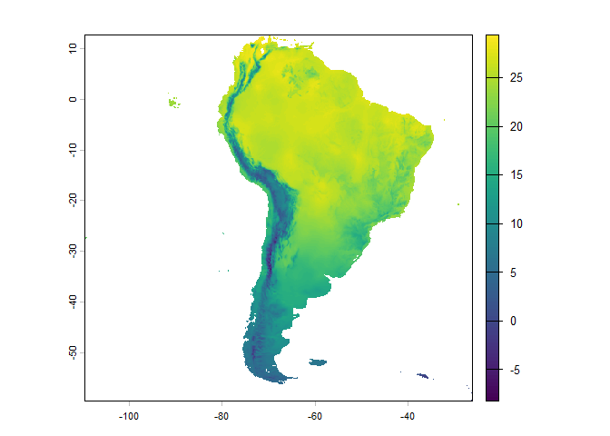

**Hard Test Solution – Shiny App Deployment as an R Package**

Evaluating Mentor: Marlon Cobos Student: Mariana Castaneda Guzman Last
updated: 2026-02-23

## Overview

`hts` is a minimal R package that deploys an interactive Shiny
application demonstrating a reproducible geospatial workflow using
WorldClim bioclimatic data.

The application performs the following steps:

1.  Downloads WorldClim global bioclimatic variables
2.  Extracts a selected BIO variable (default = BIO1)
3.  Crops the raster to South America
4.  Masks the raster using a South America boundary shapefile
5.  Visualizes the raster at each processing step

The processing workflow is handled by `helper_bio()`, while `run_app()`
launches the Shiny interface.

## Installation

Install the development version from GitHub:

``` r
# install.packages("remotes")
remotes::install_github("castanedaM/nicheR_GSoC_2026_test_solutions/hard_test_solution/hts")
```

    ## Using GitHub PAT from the git credential store.

    ## Skipping install of 'hts' from a github remote, the SHA1 (aa3b226d) has not changed since last install.
    ##   Use `force = TRUE` to force installation

## Usage

Launch the Shiny application:

``` r
hts::run_app()
```

Run the processing workflow directly:

``` r
out <- hts::helper_bio(selected_bio = 1)
names(out)
```

    ## [1] "bio_stack"   "bio"         "region"      "bio_cropped" "bio_masked"

``` r
terra::plot(out$bio_masked)
```

<!-- -->

## Package Contents

- `run_app()` - Launches the Shiny interface
- `helper_bio()` - Downloads and processes WorldClim bioclimatic data
- roxygen2 documentation
- DESCRIPTION file
- MIT License
- GitHub Actions configured to pass `R CMD check`
